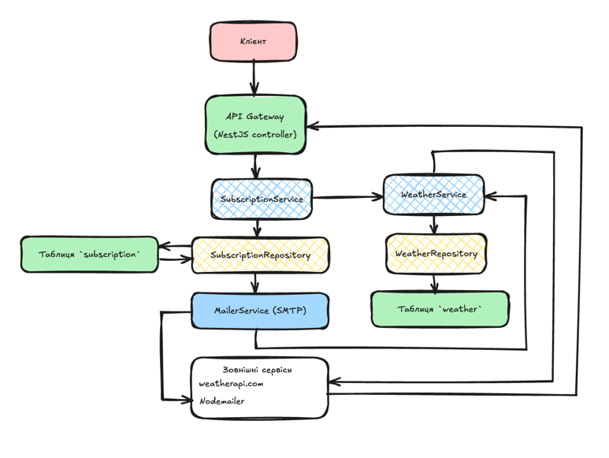

# System Design

## Контекст

### Повний контекст проблеми
Кінцеві користувачі хочуть отримувати автоматичні сповіщення про поточну погоду в обраному місті. Наразі вони виммушені постійно заходити на сайти з погодою або встановлювати окремий, зачасту платний, додаток — це незручно, особливо коли потрібно часті оновлення(кожну годину або день)

### Обмеження та вимоги

#### Функціональні
* Користувач може підписатися на розсилку прогнозу погоди
* Після реєстрації система надсилає листа з посиланням для підтвердження
* Після кліку на `/api/confirm/{token}` підписка вважається підтвердженою
* Користувач може відписатися через `/api/unsubscribe/{token}` – цей токен у листі залишається валідним доки підписка активна

#### Функціональні
* Швидкодія: час відповіді на `/weather` не більше 300 мс
* Надійність: 99.9 % часу хостингу у продакшені
* Безпека: вхідні параметри (DTO) обов’язково перевіряти через `class-validator`, лімітуємо кількість запитів (rate-limit) на `/weather` та `/subscribe`
* Моніторинг: логування всіх помилок, метрик

### Чому саме цим потрібно займатися
* Email-розсилки дозволяють автоматизовано інформувати користувачів про важливі зміни погоди без необхідності щоденного відкривання додатку або сайту
* Така функціональність корисна для користувачів, які очікують регулярних оновлень, особливо в періоди нестабільної погоди
* Це покращує загальний UX(user experience) і підвищує цінність продукту для різних категорій користувачів

## Рішення
Нижче наведено кілька ключових підходів до реалізації сервісу Weather Subscription API

### 1. Продукт (Use Cases)
#### Сценарій 1: Підписка на отримання прогнозу погоди
* Учасники: неавторизований або авторизований користувач
* Кроки:
    1. Користувач вводить свій email, назву міста (наприклад, “Lutsk”) і обирає частоту (`hourly` або `daily`).
    2. Відправляється запит `POST /api/subscribe` з тілом:
     ```json
     {
       "email": "user@example.com",
       "city": "Lutsk",
       "frequency": "hourly"
     }
     ```
    3. Сервер перевіряє DTO
    4. Якщо для цього `email+city` уже існує підписка - повертає HTTP 409 Conflict
    5. Інакше генерується `UUID token` (36 символів), `id`, запис у таблицю `subscription` з полем `confirmed = false`
    6. Відправляється підтверджувальний лист через `MailerService` з двома URL:
        - `https://<BASE_URL>/api/confirm/{token}`
        - `https://<BASE_URL>/api/unsubscribe/{token}`
    7. Сервер повертає HTTP 201 зі статусом `{ "message": "Subscription successful. Confirmation email sent." }`

#### Сценарій 2: Підтвердження підписки
* Учасники: користувач, що отримав лист
* Кроки:
    1. Запит `GET /api/confirm/{token}`
    2. Сервер шукає `subscription` за `token` (через `SubscriptionRepository.findByToken`)
    3. Якщо запису немає - HTTP 404 Not Found.
    4. Якщо запис знайдено, але `confirmed === true` - повертає HTTP 200 з повідомленням “Already confirmed” або нічого не робить
    5. Інакше змінює поле `confirmed = true` у БД (`confirmSubscription(token)`)
    6. Повертає HTTP 200 `{ "message": "Subscription confirmed successfully." }`

#### Сценарій 3: Відпискаf
* Учасники: підписник, що отримав лист або просто перейшов за посиланням
* Кроки:
    1. Запит `GET /api/unsubscribe/{token}`
    2. Сервер шукає запис `subscription` за `token`
    3. Якщо немає - HTTP 404.
    4. Якщо є - видаляє запис із таблиці (`ormRepo.remove(entity)`)
    5. HTTP 200 `{ "message": "Unsubscribed successfully." }`

#### Сценарій 4: Отримання поточної погоди
* Учасники: користувач, що отримав лист
* Кроки:
    1. Запит `GET /api/weather?city=Lutsk`
    2. Сервер через `WeatherService.getCurrent({ city: "Lutsk" })` перевіряє кеш у таблиці `weather`:
        - Викликає `WeatherRepository.findByCity("Lutsk")`
        - Якщо знайдений запис і `Date.now() – fetchedAt < 1 год` - повертає його(cached).
        - Інакше робить зовнішній HTTP-виклик (`HttpService.get(https://api.weatherapi.com/v1/current.json?key=<API_KEY>&q=Lutsk)`) - мапить відповідь у новиий об’єкт `Weather`, зберігає через `WeatherRepository.save(weather)`(upsert), і повертає клієнту
    3. Повертає JSON:
        ```json
        {
        "temperature": 22.5,
        "humidity": 60,
        "description": "Partly cloudy"
        }
        ```
    4. Якщо параметр `city` відсутній або порожній - `BadRequestException("City required")` (HTTP 400).

### 2. Інтеграція

#### Зовнішні сервіси
1. Weather API (weatherapi.com)
    - HTTP GET, кешування на 1 годину
    - Ліміт: 1000 запитів/хв
2. Email Provider(Nodemailer)
    - Кожного разу при підписці — 1 лист із підтвердженням
    - Кожного разу в `sendBatch` (з Cron) — розсилка підтвердженим підписникам.

#### Внутрішні модулі
- API Gateway
    - Приймає всі вхідні HTTP-запити
    - Проксіює(чи проксує?) їх до сервісів NestJS
    - Дозволяє встановити TLS, rate-limit, базовий CORS
- SubscriptionService/SubscriptionRepository
    - Зв’язок через інтерфейс `ISubscriptionRepository`, реалізований за допомогою TypeORM
- WeatherService/WeatherRepository
    - `WeatherRepository` використовує Entity `WeatherOrmEntity` із TypeORM із унікальним індексом на поле `city`
- SubscriptionService/WeatherService
    - Щогодинні та щоденні Cron-задачі звертаються до `WeatherService` для отримання свіжих даних


### 3. API/Контракти

#### 3.1. `/api/subscribe`
```
POST /api/subscribe
Body (application/json):
{
  "email": "[aboba@example.com](mailto:aboba@example.com)",
  "city": "Lutsk",
  "frequency": "hourly"              // or "daily"
}

Validation:
* email: валідний email, довжина 5–255
* city: непорожній рядок 1–100 символів
* frequency: enum {"HOURLY", "DAILY"}

Response:
201 Created
{
  "message": "Subscription successful. Confirmation email sent."
}

409 Conflict
{
  "statusCode": 409,
  "message": "Email already subscribed"
}
```

#### 3.2. `/api/confirm/{token}`

```
GET /api/confirm/{token}

Path Parameter:
* token: string (36 символів UUID)

Response:
200 OK
{
  "message": "Subscription confirmed successfully"
}

400 Bad Request
{
  "statusCode": 400,
  "message": "Token must be a 36-character UUID"
}

404 Not Found
{
  "statusCode": 404,
  "message": "Token not found"
}
```

#### 3.3. `/api/unsubscribe/{token}`

```
GET /api/unsubscribe/{token}

Path Parameter:
* token: string (36 символів UUID)

Response:
200 OK
{
  "message": "Unsubscribed successfully"
}

400 Bad Request
{
  "statusCode": 400,
  "message": "Token must be a 36-character UUID"
}

404 Not Found
{
  "statusCode": 404,
  "message": "Token not found"
}
```

#### 3.4. `/api/weather`

```
GET /api/weather?city={cityName}

Query Parameter:
* city: string (1–100 символів)

Response:
200 OK
{
  "temperature": number,    // наприклад, 22.5
  "humidity": number,       // відсоток, напр. 60
  "description": string     // “Partly cloudy”
}

400 Bad Request
{
  "statusCode": 400,
  "message": "City required"
}
```

### 4. Сервіси

#### 4.1 Subscription Service

##### Роль/відповідальність
- Приймає запити `/subscribe`, `/confirm/{token}`, `/unsubscribe/{token}`
- Зберігає/підтверджує/відписує підписки
- Запускає Cron-розсилки (щогодинні, щоденні)
- Викликає WeatherService для формування контексту email

##### Контракти:
```ts
subscribe(dto: CreateSubscriptionDto): Promise<void>
confirm(dto: ConfirmSubscriptionDto): Promise<void>
unsubscribe(dto: UnsubscribeDto): Promise<void>
handleHourlyNotifications(): Promise<void>
handleDailyNotifications(): Promise<void>
```

* Внутрішній виклик `sendBatch(frequency: UpdateFrequency): Promise<void>`


##### Схема даних (таблиця `subscription`)

| Поле       | Тип           | Опис                                             |
|------------|---------------|--------------------------------------------------|
| id         | UUID          | Первинний ключ                                   |
| email      | VARCHAR(255)  | Email користувача                                |
| city       | VARCHAR(100)  | Місто                                            |
| frequency  | ENUM          | `HOURLY` або `DAILY`                             |
| confirmed  | BOOLEAN       | `true`, якщо підтверджено                         |
| token      | VARCHAR(36)   | Унікальний токен для підтвердження/відписки       |
| createdAt  | TIMESTAMPTZ   | Дата створення                                   |


##### Оцінка навантаження
- Підписка/підтвердження/відписка:
    - Максимум +-500–1000 запитів/хв у піковий час (кампанії email-маркетингу).
    - Кількість записів у табл. `subscription` до +-100 000
- Cron-розсилки:
    - Якщо 50 000 підтверджених підписок (frequency=HOURLY), за індексом вибірка `SELECT * WHERE frequency='HOURLY' AND confirmed=true` повертає +-50 000 рядків на годину.
    - Для кожного викликаємо `WeatherService.getCurrent` (але кеш із TTL=1 год утримає кількість зовнішніх запитів у межах 1000шт/хв)
    - Email-провайдер: 50 000 SMTP запитів/год

#### 4.2 Weather Service

##### Роль/відповідальність
- Отримувати актуальні дані погоди для заданого міста
- Зберігати/оновлювати кеш у таблиці `weather`
- Віддавати клієнту (API `/weather`) кешовані дані, якщо вони “свіжі” (<1 год), інакше робити зовнішній запит


##### Контракти:
```ts
getCurrent(dto: GetWeatherDto): Promise<Weather>
````

* `dto.city` обов’язковий, якщо порожній → `BadRequestException("City required")`


##### Схема даних (таблиця `weather`)

| Поле       | Тип          | Опис                                    |
|------------|--------------|-----------------------------------------|
| id         | UUID         | Первинний ключ                          |
| city       | VARCHAR(100) | Унікальний ключ (індекс)                |
| temperature| NUMERIC      | Температура (°C)                        |
| humidity   | NUMERIC      | Вологість (%)                           |
| description| TEXT         | Опис погодних умов («Clear», «Rainy»…)  |
| fetchedAt  | TIMESTAMPTZ  | Час фактичного отримання даних          |
| createdAt  | TIMESTAMPTZ  | Час запису                              |

##### Оцінка навантаження
- Запити від клієнтів: до 5000 RPS (у пікові години)
- Внутрішні виклики(Cron): якщо 50000 підтверджених підписок, щогодинно виконуємо `getCurrent` 50000 разів, але 99% результатів — з кешу, тому реальних зовнішніх HTTP-запитів буде <=1000шт/хв
- Зовнішній API: ліміт 1000 запитів/хв - забезпечується кешуванням і TTL=1 год

---

### Як ми перевіряємо, що функціонал працює?

1. Unit-тести (Jest + ts-jest)
    * Пишемо тести для сервісів (`SubscriptionService`, `WeatherService`) із замоканими залежностями:
        * `SubscriptionRepository`, `WeatherRepository`, `MailerService`, `HttpService`
    * Основна мета — перевірка бізнес-логіки:
        * перевірка, що підписка не створюється повторно;
        * надсилання листів при підписці;
        * підтвердження/відписка по токену;
        * кешування або отримання погоди з зовнішнього API залежно від "свіжості" даних.

2. Integration-тести (частково через Postman + мокані сервіси)
* Тестування REST API через `POSTMAN`-колекцію:
    * `POST /api/subscribe` - створення підписки та перевірка на дублювання
    * `GET /api/confirm/{token}` - зміна `confirmed=true`
    * `GET /api/unsubscribe/{token}` - стан підписки змінюється або запис видаляється
    * `GET /api/weather?city=Lutsk` - кеш/зовнішній API → відповідь з очікуваними полями


3. E2E / Manual QA
    * Ручне тестування API через Swagger UI (`@nestjs/swagger`) або Postman

4. Покриття коду
    * Увімкнене покриття тестів через Jest:
        * `collectCoverage: true`
        * збереження у `coverage/`
    * Особливий акцент на:
        * `WeatherService.getCurrent()` (кешування, API fallback)
        * `SubscriptionService.subscribe()` (валідація, email, дублікати)
        * `sendBatch()` логіка для щогодинної/щоденної розсилки

---

### 5. Архітектура



---


## Рев’ю
- [x] Георгій
- [ ] Олександр
- [ ] Юрій
- [ ] Руслан

---

## Дедлайн
Дедлайн для узгодження та фіналізації дизайн-документа: 09:00 08/06/2025

